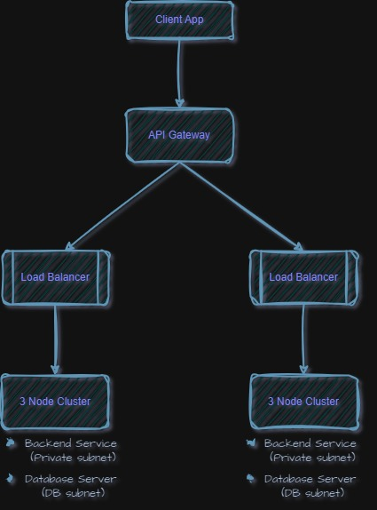

# System Architecture

Deploy application on a three-teir architecture with multi-region setup for high availability
   
+ Tier 1: Client App 
+ Tier 2: Application Server 
+ Tier 3: Database Server

## 🛠️Infrastructure Layer:
Provision required infrastructure with **Terraform** (Iac) to automate, avoid human errors, and replicatable configuration.

+ Virtual Network
+ Virtual Machines
+ Database Instance
+ Load Balancer
+ API Gateway
  + Application size may necesitate multiple **API Gateways**  

## 🖥Compute:
Provision 3 nodes 8vCPU, 16 GB RAM and a Kubernetes cluster bootstrapped with **KubeAdm**. Use **Ubuntu 24.04** as the Base OS and Kubernetes version v1.30.3.

+ 1 Control-Plane Node
+ 2 Worker Nodes

### Scalability and Performance 
+ Set up **Horizontal Pod Autoscaler (HPA)** for automatic scaling

+ Acheive efficient resource allocation Setting resource requests and limits in a deployment

## 🔍Monitoring and Logging Layer
+ Utilize **Prometheus** and **Grafana** for health and performance monitoring.

+ Logging mechanisms like **Elasticsearch** or **Kibana (EFK) stack** for log aggregation and analysis for troubleshooting

## 🔐Security Layer

+ Manage permissions with **Role Based Access Control(RBAC)**

+ Manage Pod Communications with **Network Policies**

+ Integrate security scanning tools like **Sysdig secure**

## 🗄Storage Layer
+ Regular backup of **etcd database**

+ **Volume Snapshots and cloning** for backup and restoring of persistent volumes

+  Utilize **Dynamic Provisioning** for automatic creation of storage resources

## ✈️Automation Layer:

+  Use **Docker** with **GitHub Actions** platform to build application code and automate the build, push to image resgistery, testing , and deployment pipeline

+ **GitOps** framework to manage **helm chart** repository and automate deployment to **Kubernetes** cluster

+ **Argo CD** for continuous delivery to Kubernetes cluster
_____

Tools:
- [x] Terraform
- [x] Kubernetes
- [x] Helm
- [x] Docker
- [x] Github Actions 
- [x] Elasticsearch
- [x] ArgoCD 
- [x] Sysdig secure
- [x] Kibana (EFK) stack
- [x] Prometheus 
- [x] Grafana
- [x] KubeAdm